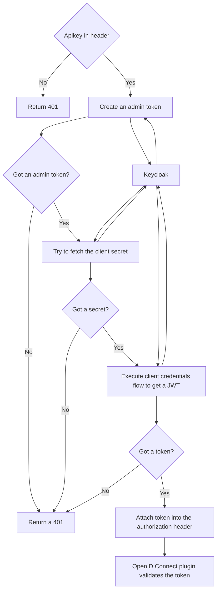

# Kong plugin validation an apikey against client_id in Keycloak

!!! Work in progress

## About

A Kong 🦍 plugin fetching an apikey and exchanging it to a JWT if a client with this ID exists in Keycloak.

The use case is about having a centralied storage for all users and application in Keycloak. Even so Keycloak itself does not know about apikeys we can use client_ids instead. So plugin executes an admin api call (admin credentials needed!) to the Keycloak API validating a client_id exists in the given realm. If it gets a response it fetches the client secret to create a JWT for this client which afterwards can be validated (for example roles, groups, scopes) using the standard Kong OpenID Connect plugin.

## Configuration parameters
|FORM PARAMETER|DEFAULT|DESCRIPTION|
|:----|:------|:------|
|config.key_header_name|apikey|The header where the apikey will be sent|
|return_unautorized_if_apikey_is_missing|true|If set a missing apikey will result in a 401 response - if set to false we will progress the next plugins anyway|
|config.keycloak_base_url||Base URL of Keycloak like https://my.keycloak.example.com. NOTE: If using a SSL endpoint make sure the certificate is trusted in the Kong setting `lua_ssl_trusted_certificate`|
|config.keycloak_realm||The realm the plugin should use to look up the client|
|config.keycloak_client_id||The client being used to create an admin token (*referencable*)|
|config.keycloak_client_secret||The secret of the client being used to create an admin token (*referencable*)|
|config.keycloak_admin_username||The admin username to create the admin token (*referencable*)|
|config.keycloak_admin_password||The admin username to create the admin token (*referencable*)|
|config.keycloak_admin_realm|master|The realm the admin user is registered at|

## Security notice

Sensitive information on the admin account for token creation can be securely stored in a vault: https://docs.konghq.com/gateway/latest/pdk/kong.vault/. See the (*referencable*) notice on the paramaters

## Known limitations / TBD

* we need to add caching
